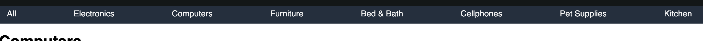

# Omozan

  Omozan is a clone of Amazon - an e-commerce website where user can order goods from different categories. In Omozan app you can browse different categories of products. In order to add a product to the shopping cart - user needs to create an account and be signed in. Users are able to add, edit or delete their reviews for products. Once items are added to the shopping cart user can adjust quantity of the products in the cart remove them from the cart, or purchase said products. Users also can search app for specific products via search bar.
  
  
# Thechnologies

This project is implemented with following technologies:
* PostgreSQL for data base
* Ruby on Rails - framework for back-end
* JavaScript
* React/Redux
* SCSS
* Webpack and Babel to bundle and transpile the source JavaScript code
* npm to manage project dependencies

# Functionality
In Omozan App, users are able to:
* Create a personal account or use a Demo User to explore webapp functionality
  - Signup form
    
  - Login form
    
  - Demo user login
    
* Users can see featured products on a front page and browse products by category or view all products for sale
  - Featured products on splash page
     
  - Index for computers department
    
  - Departments navigation
    
* Users can view details and image of individual item and its reviews
  - Product details
    
  - Product reviews
    
* Users can leave a custom review for products, later edit or delete those reviews. Each user can leave only one review for product
  - Create review button
    
  - Review form
    
* Users can search for a specific product using the search bar in the header
  - Search bar
    
  - Search Result
    

# Code snippets
* Products index fetches products for given category and populates page with product index item by passing product data in each tab, where product item procces data and outputs iformation on given product

```js
render(){
        const { products } = this.props;
        if (!products) return null;
        
        return(
            <div className="index-page">  
                <h1>{this.renderSubtitle()}</h1>
                <ul className="product-grid">
                    {products.map((product) => (
                        <ProductsIndexItem product={product} key={product.id} />
                        ))}
                </ul>
            </div>
        )
    }
```

```js
render(){
        const { product, reviews } = this.props;
        return <div className="product-tab">
            <Link to={`/products/${this.props.product.id}`}>
                <div>
                    <div className="index-img-box">
                        
                    </div>
                    {this.cutTitle(product.title,120)}
                    <div className="product-score">
                        <div className={`score-box ${this.avgScore(product.avgScore)}`}></div>
                        <div className="score-count">
                            {product.reviewCount}
                        </div>
                    </div>
                    <div className="price-box">
                        <h3>
                            ${product.price.toFixed(2)}
                        </h3>
                    </div>
                </div>
            </Link>
        </div>
    }
```
* Create/Edit Reviews button is dinamic. User is allowed only one review per product, so after creating a review - button changes from "Create review" to "Edit review" and now directs to edit form
```js
<h3>Review this product</h3>
                        <p>Share your thoughts with other customers</p>
                        <Link to={
                                this.reviewExist() ? `/reviews/edit-review/${product.id}` : `/reviews/create-review/${product.id}`
                            } > 
                            <button>
                                {!this.reviewExist() ? 
                                    "Write a customer review" : "Edit customer review "}
                            </button>
                        </Link>
```
```js
reviewExist = () => (
        Object.values(this.props.reviews).some(review => (
            review.author_id == this.props.currentUserId
        )) ? true : false
    )
```
* Searchbar is making a direct request to backend using a query 
```js
export const fetchSearchProducts = (query) => (
    $.ajax({
        method: "GET",
        url: `/api/searches/${query}`
    })
)
```
```rb
def index       
        @products = Product
                            .joins(:departments)
                            .where("departments.department = ?", params[:dep])
                            .where("title ILIKE ?", "%#{params[:title].downcase}%")
        if @products
            render "/api/products/index"
        else
            render json: ['Products not found'], status: 404
        end 
    end
 ```
